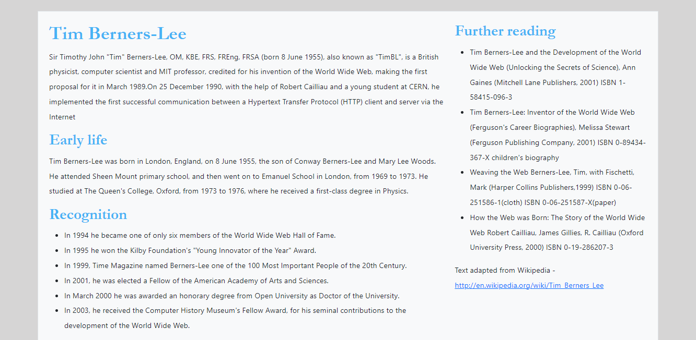

# Introduction to Bootstrap

* Download index.html. 
  * Open it in a text editor and in a browser
  * Note the link to the Bootstrap CSS file
  * Note the page already has some default styling.

## Using Bootstrap classes
* Style the page simply by using Bootstrap classes i.e. don't write any of your own CSS.
* Try and make the page look like the following image
 
* Start by focussing on the following CSS properties. Most of these are covered by the utility classes in Bootstrap https://getbootstrap.com/docs/5.0/utilities
  * Padding 
  * Margins
  * Borders
  * Font weight
  * Line height
  * Colours. You won't be able to match the colours exactly. Choose colours from Bootstrap that are as close as you can get. 

## Overriding the Bootstrap defaults
* To get the right font for the headings (Garamond), the right colours for the headings (#45b2f5) and background (#d6d5d5) create your own CSS file that will overwrite the Bootstrap CSS.

## Controlling layout
* Have a look at the layouts and grids (https://getbootstrap.com/docs/5.0/layout/grid/) and see if you can create a simple responsive design where the layout is single column on small displays and switches to two columns on larger displays e.g.

* The design should be fixed width and always sit in the center of the page.
  
## Customising Bootstrap
The problem with the above is that: 
1. We are over-writing the existing CSS with our own CSS. This is unnecessary duplication and makes the CSS hard to maintain. 
2. We are asking the user to download the entire Bootstrap framework when we are only using a limited number of features. 

Ideally we should import and extend the Bootstrap Sass code to create our own streamlined, custom version of Bootstrap. Bootstrap provide info on how to do this at https://getbootstrap.com/docs/5.0/customize/sass/. They also provide a started project at https://github.com/twbs/bootstrap-npm-starter.

The following provides a walkthrough on how we could extend the Sass code:

* Create a new folder
* Inside this folder create a simple HTML page e.g. 
```
<!DOCTYPE HTML>
<html lang="en">
<head>
<title>Bootstrap Example</title>
<meta http-equiv="content-type" content="text/html;charset=utf-8" >
  </head>
  <body>
     <h1>Bootstrap Example</h1>
  </body>
</html>
```
* Make the folder a Node.js project
```
npm init -y
```
* Install Bootstrap
```
npm i bootstrap --save
```
* Inside this project create a new folder named *scss*.
* Create a new new sass file in the *scss* folder named *custom.scss*.
* Copy the example Sass code from https://getbootstrap.com/docs/5.2/customize/sass/#importing (make sure you copy the second (option B) example).
* Paste this code into *custom.scss*.
* Make sure you have Sass installed.
```
npm install -g sass
```
* Run the ```sass``` command to watch your *custom.scss* file (you could also run this as an NPM script).
```
sass ./scss/custom.scss ./css/style.css --watch
```
* In *custom.scss* make a change e.g. we could change the colour of the headings:
```
...
// 2. Include any default variable overrides here
$headings-color:red;
...
```
The advice is to use the existing Bootstrap variables .e. if you look in *npm_modules/bootstrap/scss/_variables.scss* you will be able to find lots of variables for headings (and other elements). We set these variables in our *custom.scss* to override these default values.
* Saving this *custome.scss* should generate a *style.css* file in a *css* folder. 
* Add a link to *style.css* from your web page i.e.
```
 <link href="css/style.css" type="text/css" rel="stylesheet">
```
* If you open your webpage in a browser you should find that the heading is coloured red. 

> Importantly, *custom.scss* only imports a 'bare bones' version of Bootstrap that is much smaller in file size.  When we specify values for variables we don't generate duplicate CSS rules.

## There's lots more
* There's lots more you can do with Bootstrap e.g. components. Components are reusable commonly used UI elements e.g. navigation bars, accordians, buttons. Bootstrap 'off the shelf' components written in HTML, JavaScript and CSS which we can then customise. 
